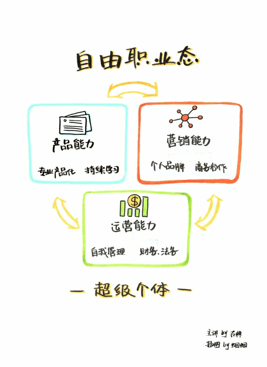

#2-1 你羡慕的自由职业的真相
古典 2016年10月31日

##一个观察
去年发布的“公众眼中最具幸福感的职业”中，“自由职业者”第一次登上榜首，取代了“政府官员”，成为第一名。值得关注的是，在2014年自由职业者还排名第四，2013年则是排名第六。
越来越多的人希望自己成为自由职业者。但是你环顾四周，有多少人是自由职业者？这些人的状态到底好不好？
我手头还有另外一份关于自由职业者的报告，《2014年O2O中国自由职业者现状报告》，总结的三大好处分别是：时间自由、地点自由、不用看老板脸色 ；但是三大缺点是：收入不稳、社交范围窄和心理负担大。
关于近年来自由职业越来越流行这个事，我提出过一个更本质的概念，叫做 “自由职业态” ，今天我们重新解读和升级一下这个概念，帮你辨析自由职业者背后的核心逻辑。
##一个概念
为什么人们喜欢自由职业者，因为这个名字有两个非常诱惑的字： 自由 。
但是你仔细思考，就会发现这个“自由”后面的意思非常不清晰。
**时间空间自由？** ——你可以选择什么时间、在哪里上班，但是还是需要面对客户的最终时间底线。出租车司机看似很自由，但是回家的时间取决于什么时候能够拉到活。
**关系自由？**——你依然需要选择不一定喜欢的客户，他的脸色也不一定就比你的上司好看。
反过来看，在一个组织里面上班，就很不自由吗？
很多企业的高管也不坐班；一个真正优秀的设计师，也拥有和自己的管理者讨论方案、甚至拒绝的自由。
小米的黎万强在小米如日中天的时候，选择闭关半年，用一段时间拍照、发呆，去硅谷充电、思考。这其实也挺自由的。
我们公司的赵昂也是这样，他自己做生涯咨询，所以并不需要他坐班，只要完成自己的绩效目标。他在其他领域也有一些自己的课程，但只要不和公司业务有冲突，不影响自己工作，我们也支持他。
他们一样很自由。之所以他们不辞职自己干，一方面因为组织给了他们宽松的环境，一方面因为他们意识到，个人的能力要在组织的平台上才能更加放大，自己成就了组织，组织也反过来成就自己 。
##一个策略
讲到现在，可能大家有点混乱，到底什么是自由职业？
自由职业的本质其实不是自由，而是职业能力。
人与职业有三个阶段的关系： 雇佣-自由交易-共创 。
自由职业态就是达到了自由交易的状态，你可以不一定为这个人工作，如果这里不爱干可以换个地方。
你期待的自由，短期是“不需要非得和这些人交易”的自由；长期是“不需要为钱工作”的自由。
这种自由背后的，是一种“ 一个人就是一家公司 ”的能力。
能力包括三个部分：
- 把能力封装成产品的能力（产品能力）
- 把能力卖出去的能力（营销能力，也包括很多人熟悉的“个人品牌”）
- 自我管理、持续学习的能力，以及基本的财务、法务能力 （运营能力）
如果你能自己一个人拥有这些能力，一个人就是一个公司，你完全拥有了随时自由交易的能力。这就是自由职业态。
一个有自由职业态的人，他可以选择待在公司，也可以选择自由出去。相比那些为了生计不得不劳累奔波的自由职业者。他们才是终极自由的。
##一个总结
人和组织的关系有三个层次，雇佣-不得不为你干；交易-选择为你干；共创-我们一起干。
自由职业态的自由，是指自己的能力达到了能与企业自由交易的程度的状态。
拥有自由职业态的人是这样一群人：他们能把能力包装成产品；也能进行营销和商务合作；他们能够自我管理、自我升级，也具备基本的财务、法务能力。
##今日精进
1. 你羡慕自由职业者吗？最羡慕他们的哪些特质？
2. 你距离自由职业态的能力要求，还差多远？
3. 如果有一天你达到了自由职业态，你会考虑自由职业，还是进一步与企业更深程度合作？