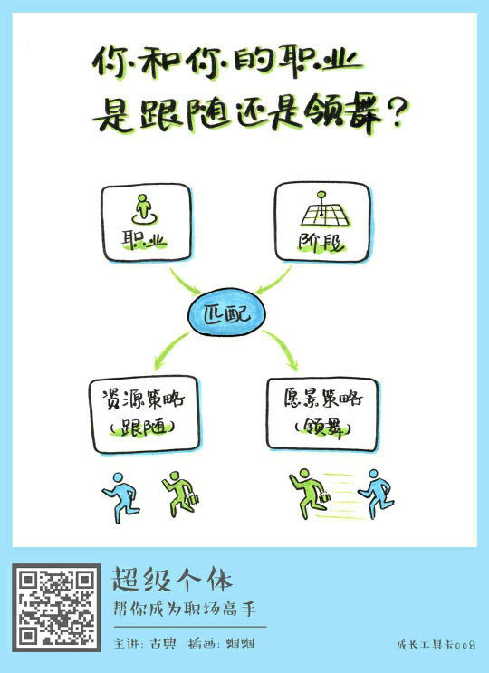

#3-2 该现实点还是理想点？选择职业匹配的2种策略
古典2016年11月8日

##一个观察
你有没有看过电影《闻香识女人》中的那段经典的探戈？盲眼中尉和女孩踩着节奏，你进我退，搭配得天衣无缝，那首歌就叫做《一步之遥》——跳舞是一种高度默契，相互匹配的艺术。人和职业的关系就像是一段舞蹈，是一种动态匹配。
那么，什么时候需要我们去跟随，主动适应职业；什么时候我们应该领舞，让职业来匹配我们？  
##一个概念
职业中永远有2种匹配的策略。
**一种叫做资源策略**，就是从已有的能力资源出发，先做好手边的事情，能做什么做什么，能做好什么做好什么。
**另一种叫做愿景策略**，就是从自己的需求出发，倒推满足条件——要达到这个目标，我该有什么能力和资源？然后主动地去补。这两种都是不错的职业策略。
资源策略是一种现实主义的跟随策略，它的好处是效率很高，非常务实，马上能开始，立刻就有收益，而且压力很小。坏处是你做的事情可能不完全是你想做的，你收到的回馈也不一定你都喜欢。长时间的跟随会导致一个人的惰性，如果一个人总是待在自己舒适圈里，一个萝卜一个坑，长久下来，萝卜变成了坑的模样。一旦组织变化，他自己是第一个死的。
愿景策略则是一种理想主义的领跑策略，它的好处是你终究能获得自己想要的东西，但是坏处是，这可能需要很久，因为能力和资源的培养不是一朝一夕的事。完美主义其实就是一种愿景策略的失败示范——你纠结于要完全满足自己的需求，但是资源能力短期内就是不够，就迟迟不拿出手，越是不拿出手，越是没法做下一轮互动——结果自己把自己憋死了。
##一个策略
当你理解了不同职业的优缺点，你就能理解——不同的职业类型，其实要应用不同的策略。
资源策略非常适合那些门槛不高，但实践经验大于知识学习的岗位，比如销售、市场、传媒、产品经理、行政、人力，这些领域门槛不高，但想做好必须有丰富的实操经验。这样的职位边练边学非常重要，一定要尽早开始做，练中学。
愿景策略适合那些需要大量完整的专业知识积累才能开始的岗位，比如说医生、律师、科研，这些领域要做好需要数年的完整训练，一定要尽早选定，尽早开始，先学好再练。而且一旦选定，转换成本很高。
很多人的职业发展不顺利，就是职业策略搞混了的原因——想当个作家，结果看了200本关于写作的书，却一个字也没有写。其实写作就是一件资源策略，需要练中学的事。反过来，有人突然想做科学家，然后在家开始试验，宣布发现了划时代科学结晶——现代的科学早就不是一个人的事了——这些人往往最终成为了民间科学家，类似的例子还有神医……这都是发展的策略搞混了。
那么我们在当前的职业中应该采取什么策略呢？ 
一般来说，刚进入职场，或者进入一个新的组织、圈子，组织强大，你只是个新兵——最好的策略一定是跟随，先搞清楚需求，先适应，再求生存。这个时候组织在领舞——它对你的期待是先做好手头事，也会提供很多资源、培训、谈话，帮助你跟上。
这种适应和能力高低无关——即使是高管空降，一般也会先丢到洼地——给他职位放低一级，等到适应了环境，做出来成绩，然后才放到位。
等你度过了适应期，资源导向的劣势就逐渐显现出来。长期跟随让你进步不多，你到底是上了10年班，还只是把第一年的班上了10年？
这个时候，就需要你转换成愿景策略——你到底想要什么？你如何发挥自己独有的天赋和优势？你如何在组织里实现自己的价值？
这时你有了成功经验，有了话语权，也有了能力筹码。组织反而会主动思考如何满足你的需求，升职、调岗、还是内部创业的机会……你开始领舞了。
这两个策略搞混了，也是灾难——
有一位名校毕业的研究生，进华为一段时间后，给任正非写了封万言书，详细地点评了华为的经营策略和发展建议。任正非的批示是：“如果没有精神病，建议辞退。”方式很任正非，其实道理也可以理解——一个组织的经营策略和战略，不仅仅基于教科书，更加基于组织背后的历史、企业文化和未来趋势——这不是一个刚进入组织的人可以马上理解的。这个新员工显然选错了策略。
混圈子也是一样，在我看来，那些一开始就丢出一堆头衔，然后带着一副我去你不是不认识我吧的表情的人是最没料的。真正的牛人很少在一开始就夸耀自己，最好的自我介绍方式不是一开始长长的头衔，而是当他丢出一个精彩的观点，大家私下议论，这个人是谁？
沟通讲究先跟后带，职业也是一样。
有个人听说耶稣是个圣人，于是前往耶路撒冷拜访他。
到了城外，他却看到耶稣正蹲在地上，为他的一个门徒洗脚。
他非常失望，为什么你这么高贵的人，却去做这样低贱的事情呢？
耶稣站起来，甩甩手上的水珠，说：
如果你想领导谁，就服务谁。
##一个总结
我们提到了职业发展的2个策略，资源策略和愿景策略。不同的职业，有不同的策略。职业的不同阶段，也有不同的策略。你也许会更深地了解我们昨天提出的定义：职业是一个持续地通过满足他人需求来自我实现的社会交换手段。
##今日精进
1. 在你现在生活和工作的分项里，有哪些是属于“有什么做好什么”，有哪些领域属于就是要“做自己想做的事”？
2. 你是怎么理解：“你要领导谁，就要服务谁”这句话的？在你的生活中，你又被谁用服务的方式领导过？